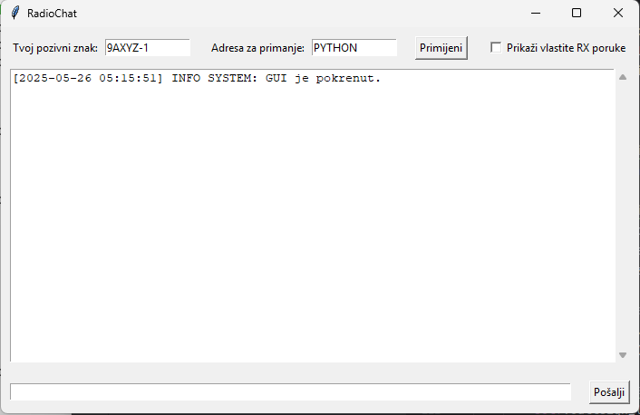

# 📡 APRS KISS Chat GUI

Jednostavna desktop aplikacija za slanje i primanje APRS poruka putem DireWolf-a koristeći KISS TCP protokol. Aplikacija omogućava chat sučelje s bojama i lokalno sprema sve poruke u SQLite bazu.



---

## 🚀 Značajke

- ✅ Podrška za APRS poruke u formatu `:DESTINATN:message`
- ✅ Komunikacija s DireWolfom preko KISS TCP (port 8001)
- ✅ AX.25 enkodiranje i parsiranje
- ✅ Sučelje nalik chat aplikaciji (Tkinter GUI)
- ✅ Pohrana svih RX/TX poruka u SQLite bazu (`messages.db`)
- ✅ Bojanje poruka prema vrsti (RX zeleno, TX plavo, INFO sivo)
- ✅ Višedretvena obrada
- ✅ Validacija pozivnih znakova i SSID-a

---

## 🛠 Tehnologije

- **Python 3.10+**
- **Tkinter** – GUI
- **Socket** – TCP komunikacija
- **SQLite3** – lokalna baza podataka
- **Regex** – validacija korisničkog unosa
- **DireWolf** – softverski TNC (mora biti pokrenut)

---

## ⚙️ Kako pokrenuti

### 1. Preduvjeti

- [DireWolf](https://github.com/wb2osz/direwolf) mora biti instaliran i pokrenut s KISS TCP podrškom, u direwolf.conf potrebno je pravilno konfigurirati izlazne i ulazne audio uređaje:
  ```bash
  direwolf -t 0 -p -n 1 -c direwolf.conf
